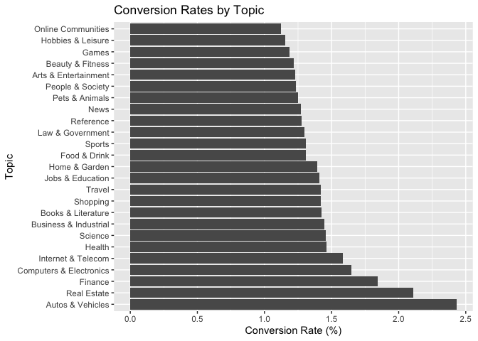
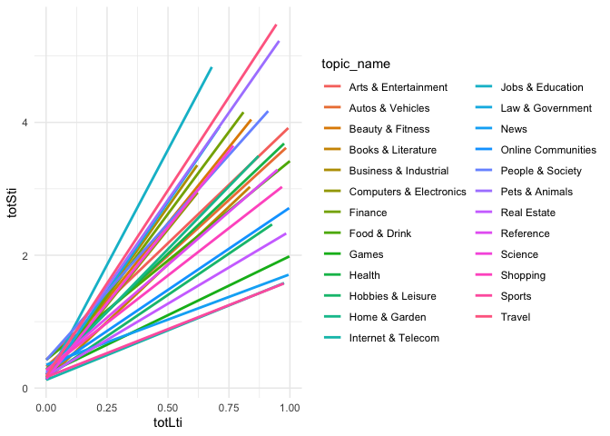

Final Report
================

## INTRODUCTION

How Does Consumer Browsing by Topic Translate to Their Conversion
Potential?

Valassis is interested in improving marketing technology and consumer
engagement through analysis and applications of consumer browsing
behavior. With only limited funding for marketing, it is important to be
able to predict and target which consumers are more likely to convert
(to click on an advertisement and perform a meaningful action). To
design a predictive model, analysis of the consumer data focused on
identifying associations between a user’s likelihood to convert and
their short-term and long-term browsing interests by topic.

## Analysis

``` r
training = read_csv("../../data/training_tallskinny.csv")
```

    ## Parsed with column specification:
    ## cols(
    ##   userID = col_double(),
    ##   inAudience = col_logical(),
    ##   topic_id = col_double(),
    ##   ltiFeatures = col_double(),
    ##   stiFeatures = col_double()
    ## )

``` r
validation = read_csv("../../data/validation_tallskinny.csv")
```

    ## Parsed with column specification:
    ## cols(
    ##   userID = col_double(),
    ##   inAudience = col_logical(),
    ##   topic_id = col_double(),
    ##   ltiFeatures = col_double(),
    ##   stiFeatures = col_double()
    ## )

``` r
interest_topics = read_csv("../../data/interest_topics.csv")
```

    ## Parsed with column specification:
    ## cols(
    ##   topic_id = col_double(),
    ##   topic_name = col_character()
    ## )

\*\*\*a note: we only used the training set, for the arbitrary reason
that it was larger.

``` r
topics_training <- left_join(training, interest_topics) %>%
  select(userID, inAudience, topic_name, everything())
```

    ## Joining, by = "topic_id"

## Initial Graph

``` r
true_training <- topics_training %>%
  group_by(topic_name) %>%
  count(inAudience) %>%
  filter(inAudience == TRUE) %>%
  arrange(desc(n)) %>%
  drop_na()
true_training %>%
  ggplot(aes(x = reorder(topic_name,-n), n)) +
  geom_bar(stat ="identity") +
   theme_void()
```

<!-- --> This is a
distribution of the frequencies of all the sub catagories in the
training dataset. It does not tell us a lot of information so we need to
look further into our data\!

## Removing Subcatagories

``` r
specL <- topics_training %>%
  mutate(topic_name = case_when(
    str_detect(topic_name, "/Arts & Entertainment") ~ "Arts & Entertainment",
    str_detect(topic_name, "/Autos & Vehicles") ~ "Autos & Vehicles",
    str_detect(topic_name, "/Beauty & Fitness") ~ "Beauty & Fitness",
    str_detect(topic_name, "/Books & Literature") ~ "Books & Literature",
    str_detect(topic_name, "/Business & Industrial") ~ "Business & Industrial",
    str_detect(topic_name, "/Computers & Electronics") ~ "Computers & Electronics",
    str_detect(topic_name, "/Finance") ~ "Finance",
    str_detect(topic_name, "/Food & Drink") ~ "Food & Drink",
    str_detect(topic_name, "/Games") ~ "Games",
    str_detect(topic_name, "/Health") ~ "Health",
    str_detect(topic_name, "/Hobbies & Leisure") ~ "Hobbies & Leisure",
    str_detect(topic_name, "/Home & Garden") ~ "Home & Garden",
    str_detect(topic_name, "/Internet & Telecom") ~ "Internet & Telecom",
    str_detect(topic_name, "/Jobs & Education") ~ "Jobs & Education",
    str_detect(topic_name, "/Law & Government") ~ "Law & Government",
    str_detect(topic_name, "/News") ~ "News",
    str_detect(topic_name, "/Online Communities") ~ "Online Communities",
    str_detect(topic_name, "/People & Society") ~ "People & Society",
    str_detect(topic_name, "/Pets & Animals") ~ "Pets & Animals",
    str_detect(topic_name, "/Real Estate") ~ "Real Estate",
    str_detect(topic_name, "/Reference") ~ "Reference",
    str_detect(topic_name, "/Science") ~ "Science",
    str_detect(topic_name, "/Shopping") ~ "Shopping",
    str_detect(topic_name, "/Sports") ~ "Sports",
    str_detect(topic_name, "/Travel") ~ "Travel",
    TRUE ~ as.character(topic_name)
  ))
```

``` r
spec <- specL %>%
  group_by(userID, topic_name, inAudience) %>%
  drop_na() %>%
 summarize(totLti = sum(ltiFeatures),
           totSti = sum(stiFeatures))
```

## graphing conversion rate proportions

``` r
spec_true <- spec %>%
  group_by(topic_name) %>%
  count(inAudience) %>%
  filter(inAudience == TRUE) %>%
  select(topic_name, n)
names(spec_true)[2] <- "True"

spec_false <- spec %>%
  group_by(topic_name) %>%
  count(inAudience) %>%
  filter(inAudience == FALSE) %>%
  select(topic_name, n)
names(spec_false)[2] <- "False"
spec_gathered <- full_join(spec_true, spec_false)
```

    ## Joining, by = "topic_name"

``` r
spec_prop <- spec_gathered %>%
  mutate(prop = (True/(True + False))*100) %>%
  arrange(desc(prop))

spec_prop %>%
  arrange(prop) %>%
  ggplot(aes(x = reorder(topic_name,-prop), prop)) +
  geom_bar(stat ="identity") +
  coord_flip() +
  labs(y = "Conversion Rate (%)", x ="Topic", title = "Conversion Rates by Topic")
```

<!-- -->

``` r
spec_true %>%
  ggplot(aes(x = reorder(topic_name,-True), True)) +
  geom_bar(stat ="identity") +
  coord_flip() +
  labs(y = "Number of users in audience", x ="Topic", title = "Audience nums by Topic")
```

<!-- --> A
distinction we decided to make was between the more popular topics of
interest, ie the numbers of users who had the topic as a value of
interest, and those that were associated with the conversion rate.

\*\*\* a note: what we call the ‘conversion rate’ is simply the ratio
between the number of users who were interested in the particular topic
and were converted in the past, and the total number of those who were
interested in the particular topic.

Interestingly enough, Arts and Entertainment, News, and Reference were
much more popular, but categories like Auto and Vehicles, Real Estate,
and Finance, had a higher conversion rate. This could be for a variety
of reasons. One possibility is that the topics with the highest
conversion rates tend to relate to necessities and are only browsed by
users when they have a high motivation to make a purchase. Real Estate,
for instance, has a low browsing popularity overall, but it has a very
high conversion rate amongst its smaller pool of users. Individuals may
only browse for real estate when they are in need of housing, a basic
necessity, and therefore have a very high motivation to make a purchase
or significant action with respect to advertisements. Arts &
Entertainment, on the other hand, ranks the highest in browsing
popularity, but it has the fifth lowest conversion rate. Many
individuals may be inclined to browse about Arts & Entertainment, but it
is not a necessity and individuals may have a substantially lower
motivation to convert as a result.

## Adding a column of topic names to the dataframe

``` r
training %>%
  names()
```

    ## [1] "userID"      "inAudience"  "topic_id"    "ltiFeatures" "stiFeatures"

``` r
interest_topics %>%
  names()
```

    ## [1] "topic_id"   "topic_name"

``` r
user1 <- training %>%
  filter(userID == 1) 


user1Interest <- full_join(user1, interest_topics)
```

    ## Joining, by = "topic_id"

``` r
user1Interest$userID <- 1
user1Interest <- user1Interest %>%
  mutate_all(~replace(., is.na(.), 0))

joined <- full_join(training, interest_topics)
```

    ## Joining, by = "topic_id"

## Plotting conversion rates against topic names

``` r
notConverted <- joined %>%
  group_by(topic_name) %>%
  count(inAudience) %>%
  filter(inAudience == FALSE) %>% 
  select(topic_name, n)

converted <- joined %>%
  group_by(topic_name) %>%
  count(inAudience) %>%
  filter(inAudience == TRUE) %>%
  select(topic_name, n)


names(notConverted)[2] <- "false"
names(converted)[2] <- "true"

both <- full_join(notConverted, converted)
```

    ## Joining, by = "topic_name"

``` r
both <- both %>%
  ungroup() %>%
  mutate(rate = true/(true + false))

both %>%
  arrange(desc(rate)) %>%
  select(topic_name, rate) %>%
  slice(1:20) %>%
  arrange(desc(rate))
```

    ## # A tibble: 20 x 2
    ##    topic_name                                                          rate
    ##    <chr>                                                              <dbl>
    ##  1 /Computers & Electronics/Software/Operating Systems/Mobile OS/Sy… 0.125 
    ##  2 /Autos & Vehicles/Motor Vehicles (By Brand)/SEAT                  0.0726
    ##  3 /Autos & Vehicles/Motor Vehicles (By Brand)/Kia                   0.0724
    ##  4 /Autos & Vehicles/Motor Vehicles (By Brand)/Honda                 0.0620
    ##  5 /Autos & Vehicles/Motor Vehicles (By Brand)/Hyundai               0.0609
    ##  6 /Autos & Vehicles/Motor Vehicles (By Brand)/Mazda                 0.0588
    ##  7 /Autos & Vehicles/Motor Vehicles (By Brand)/Mitsubishi            0.0539
    ##  8 /Autos & Vehicles/Motor Vehicles (By Brand)/Nissan                0.0520
    ##  9 /Finance/Investing/Socially Responsible Investing                 0.0516
    ## 10 /Autos & Vehicles/Motor Vehicles (By Brand)/Lincoln               0.0510
    ## 11 /Autos & Vehicles/Motor Vehicles (By Brand)/Subaru                0.0505
    ## 12 /Autos & Vehicles/Motor Vehicles (By Brand)/Buick                 0.0500
    ## 13 /Autos & Vehicles/Motor Vehicles (By Brand)/Toyota                0.0485
    ## 14 /Autos & Vehicles/Motor Vehicles (By Type)/Microcars & Subcompac… 0.0484
    ## 15 /Computers & Electronics/Computer Hardware/Computer Peripherals/… 0.0478
    ## 16 /Sports/Sporting Goods/Cricket Equipment                          0.0476
    ## 17 /Autos & Vehicles/Motor Vehicles (By Brand)/Honda/Acura           0.0475
    ## 18 /Autos & Vehicles/Vehicle Shopping                                0.0472
    ## 19 /Autos & Vehicles/Motor Vehicles (By Type)/Trucks, Vans & SUVs/S… 0.0470
    ## 20 /Autos & Vehicles/Vehicle Shopping/Vehicle Dealers & Retailers    0.0470

We also wanted to look at the subtopics’s conversion rates, and we found
that the subtopic with the highest proportion of converted entries was
Symbian OS, nested inside the Computers and Electronics topic.
Interestingly, Symbian is a discontinued operating system.

## looking at average score

``` r
spec %>%
  group_by(topic_name) %>%
  summarize(n = mean(totLti)) %>%
  arrange(desc(n)) %>%
  ggplot(aes(x = reorder(topic_name,-n), n)) +
  geom_bar(stat ="identity") +
  coord_flip() +
  labs(x = "Topic Catagory", y = "Average Interest Score (lt)", title = "for all entries")
```

<!-- -->

``` r
spec %>%
  filter(inAudience == TRUE) %>%
  group_by(topic_name) %>%
  summarize(n = mean(totLti)) %>%
  arrange(desc(n)) %>%
  ggplot(aes(x = reorder(topic_name,-n), n)) +
  geom_bar(stat ="identity") +
  coord_flip() +
  labs(x = "Topic Catagory", y = "Average Interest Score (lt)", title = "for entries who have converted in the past")
```

<!-- -->

``` r
joined %>%
  drop_na() %>%
  group_by(topic_name) %>%
  summarise(average = mean(ltiFeatures)) %>%
  arrange(desc(average)) %>%
  ungroup()%>%
  slice(1:20)
```

    ## # A tibble: 20 x 2
    ##    topic_name                                                       average
    ##    <chr>                                                              <dbl>
    ##  1 /Arts & Entertainment/Celebrities & Entertainment News            0.117 
    ##  2 /Arts & Entertainment                                             0.0874
    ##  3 /Food & Drink/Cooking & Recipes                                   0.0772
    ##  4 /Autos & Vehicles/Motor Vehicles (By Brand)/Mini                  0.0693
    ##  5 /Online Communities/Dating & Personals/Personals                  0.0659
    ##  6 /News/Local News                                                  0.0578
    ##  7 /People & Society/Ethnic & Identity Groups/Asians & Diaspora/So…  0.0554
    ##  8 /Sports/Fantasy Sports                                            0.0524
    ##  9 /Games/Word Games                                                 0.0472
    ## 10 /Arts & Entertainment/Humor                                       0.0449
    ## 11 /News/Weather                                                     0.0446
    ## 12 /Games/Computer & Video Games/Gaming Reference & Reviews          0.0446
    ## 13 /Arts & Entertainment/Fun & Trivia/Fun Tests & Silly Surveys      0.0431
    ## 14 /Internet & Telecom/Email & Messaging                             0.0430
    ## 15 /Games/Roleplaying Games                                          0.0427
    ## 16 /Games/Computer & Video Games/Massively Multiplayer Games         0.0427
    ## 17 /Reference/General Reference                                      0.0422
    ## 18 /Autos & Vehicles/Vehicle Codes & Driving Laws/Vehicle Licensin…  0.0388
    ## 19 /News                                                             0.0380
    ## 20 /News/Sports News                                                 0.0373

We also calculated the average score for the interests of entries in
each category. The first graph is for all entries, while the second one
is filtered for folk who have converted in the past. Interestingly, the
values are smaller in the filtered dataset than in the general dataset.
This can be explained by the fact that there are significantly more data
points in the general dataset than the one that is filtered. The most
significant change between the two visualizations is that Autos and
Vehicles have moved up significantly amongst the relative averages. This
is consistent with our previous visualizations that showed that the
conversion rate was highest for Autos and Vehicles.

## looking at number of interests per user

``` r
spec_nums <- spec %>%
  group_by(userID) %>%
  count(userID)
names(spec_nums)[2] <- "num_interests"
spec_nums
```

    ## # A tibble: 25,749 x 2
    ## # Groups:   userID [25,749]
    ##    userID num_interests
    ##     <dbl>         <int>
    ##  1      5            20
    ##  2     10            11
    ##  3     13            21
    ##  4     14            19
    ##  5     19            18
    ##  6     25            17
    ##  7     30            10
    ##  8     33            19
    ##  9     34            13
    ## 10     38            23
    ## # … with 25,739 more rows

``` r
spec <- left_join(spec, spec_nums)
```

    ## Joining, by = c("userID", "num_interests")

``` r
spec %>%
  group_by(topic_name) %>%
  drop_na() %>%
 summarize(meanInt = mean(num_interests)) %>%
  arrange(desc(meanInt))
```

    ## # A tibble: 25 x 2
    ##    topic_name              meanInt
    ##    <chr>                     <dbl>
    ##  1 Finance                    17.2
    ##  2 Real Estate                17.1
    ##  3 Autos & Vehicles           16.7
    ##  4 Science                    16.6
    ##  5 Computers & Electronics    16.6
    ##  6 Home & Garden              16.6
    ##  7 Business & Industrial      16.5
    ##  8 Pets & Animals             16.4
    ##  9 Hobbies & Leisure          16.3
    ## 10 Jobs & Education           16.3
    ## # … with 15 more rows

``` r
spec %>%
  group_by(inAudience) %>%
  summarize(mean(num_interests))
```

    ## # A tibble: 2 x 2
    ##   inAudience `mean(num_interests)`
    ##   <lgl>                      <dbl>
    ## 1 FALSE                       15.8
    ## 2 TRUE                        17.3

We decided to look a little into the effects of the number of interests
individuals had on their likelihood to be converted. As you can see
entries that had been converted had a higher average value for number of
entries. (True in this case means they had been converted)

## Short Term Interest Analysis

``` r
joined %>%
  drop_na() %>%
  group_by(topic_name) %>%
  summarise(average = mean(stiFeatures)) %>%
  arrange(desc(average))
```

    ## # A tibble: 1,385 x 2
    ##    topic_name                                                       average
    ##    <chr>                                                              <dbl>
    ##  1 /Jobs & Education/Education/Alumni & Reunions                      0.722
    ##  2 /Arts & Entertainment/Performing Arts/Circus                       0.470
    ##  3 /Jobs & Education/Education/Colleges & Universities/Fraternitie…   0.399
    ##  4 /Shopping/Apparel/Clothing Accessories/Gems & Jewelry/Rings        0.387
    ##  5 /Online Communities/Feed Aggregation & Social Bookmarking          0.370
    ##  6 /Sports/Sporting Goods/American Football Equipment                 0.368
    ##  7 /Online Communities/Blogging Resources & Services                  0.368
    ##  8 /Arts & Entertainment/Fun & Trivia/Fun Tests & Silly Surveys       0.365
    ##  9 /Computers & Electronics/Programming/Java (Programming Language)   0.303
    ## 10 /Autos & Vehicles/Vehicle Codes & Driving Laws/Vehicle Licensin…   0.302
    ## # … with 1,375 more rows

We can see that the Jobs & Education category has been getting
increasing attention over the past month.

``` r
spec %>%
  ggplot(mapping = aes(x = totLti, y = totSti, color = topic_name)) +
  geom_smooth(method=lm, se = FALSE) +
  theme(legend.position = "none") +
  theme_minimal()
```

<!-- -->

``` r
spec %>%
  ggplot(mapping = aes(x = totLti, y = totSti, color = topic_name)) +
  geom_point() +
  facet_wrap(~ topic_name) +
  theme_minimal() +
  theme(legend.position = "none")
```

<!-- -->

Here we examined the relationship between short-term and long-term user
interest scores by topic. We found that Jobs & Education, Arts &
Entertainment, and Pets & Animals showed the greatest positive
associations between long and short-term user interest scores. An
important note, though, is that the correlations for these topics could
be overstated as the data is varied and outliers were factored into the
trendlines shown above. An example of this is in the Jobs and Education
graph (teal colored) as shown by its scatter plot.
