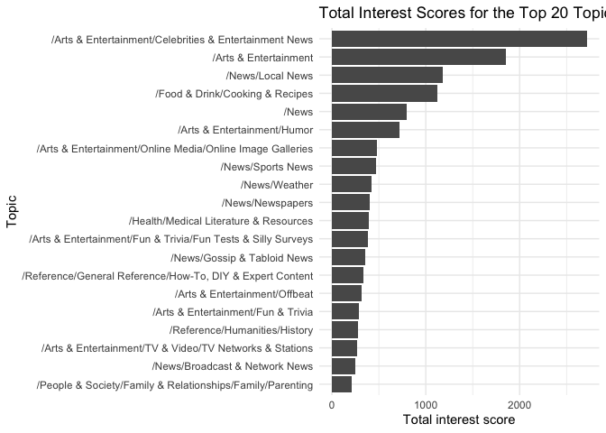

Data Exploration
================
Margaret Reed, Yi Chen, Caroline Maloney, Evelyn Cupil-Garcia
Nov 2, 2019

## Adding a column of topic names to the dataframe

``` r
training %>%
  names()
```

    ## [1] "userID"      "inAudience"  "topic_id"    "ltiFeatures" "stiFeatures"

``` r
interest_topics %>%
  names()
```

    ## [1] "topic_id"   "topic_name"

``` r
user1 <- training %>%
  filter(userID == 1) 


user1Interest <- full_join(user1, interest_topics)
```

    ## Joining, by = "topic_id"

``` r
user1Interest$userID <- 1
user1Interest <- user1Interest %>%
  mutate_all(~replace(., is.na(.), 0))

joined <- full_join(training, interest_topics)
```

    ## Joining, by = "topic_id"

## Plotting conversion rates against topic names

``` r
notConverted <- joined %>%
  group_by(topic_name) %>%
  count(inAudience) %>%
  filter(inAudience == FALSE) %>% 
  select(topic_name, n)

converted <- joined %>%
  group_by(topic_name) %>%
  count(inAudience) %>%
  filter(inAudience == TRUE) %>%
  select(topic_name, n)


names(notConverted)[2] <- "false"
names(converted)[2] <- "true"

both <- full_join(notConverted, converted)
```

    ## Joining, by = "topic_name"

``` r
both <- both %>%
  ungroup() %>%
  mutate(rate = true/(true + false))

both <- both %>%
  arrange(desc(rate)) %>%
  select(topic_name, rate) %>%
  slice(1:20) %>%
  arrange(desc(rate))

xlabs <- c("Symbian OS", "SEAT", "Kia", "Honda", "Hyundai", "Mazda", "Mitsubishi", "Nissan", 
           "Socially Responsible Investing", "Lincoln", "Subaru", "Buick", "Toyota", "Microcars & Subcompacts", 
           "Ink & Toner", "Cricket Equipment", "Acura", "Vehicle Shopping", "SUVs & Crossovers", "Retailers")

ggplot(both, mapping = aes(x = reorder(topic_name, rate), y = rate)) +
  geom_col() +
  coord_flip() + 
  labs(x = "Topic", 
       y= "Conversion Rate", 
       title = "Conversion rates by Subtopic") +
  scale_x_discrete(waiver(), labels = rev(xlabs)) + 
  theme_minimal()
```

<!-- -->

``` r
joined %>%
  drop_na() %>%
  group_by(topic_name) %>%
  summarise(sum = sum(ltiFeatures)) %>%
  arrange(desc(sum)) %>%
  ungroup()%>%
  slice(1:20) %>%
  ggplot(mapping = aes(x = reorder(topic_name, sum), y = sum)) +
    geom_col() + 
  coord_flip() + 
  labs(title = "Total Interest Scores for the Top 20 Topics", 
       x = "Topic", 
       y = "Total interest score") + 
  theme_minimal()
```

<!-- -->

``` r
joined %>%
  drop_na() %>%
  group_by(topic_name) %>%
  summarise(average = mean(ltiFeatures)) %>%
  arrange(desc(average)) %>%
  ungroup()%>%
  slice(1:20) %>%
  ggplot(mapping = aes(x = reorder(topic_name, average), y = average)) +
  geom_col() + 
  coord_flip() + 
  labs(title = "Average Interest Scores Per User for the Top 20 Topics", 
       x = "Topic", 
       y = "Average interest score per user") + 
  theme_minimal()
```

<!-- -->

## Short Term Interest Analysis

``` r
joined %>%
  drop_na() %>%
  group_by(topic_name) %>%
  summarise(average = mean(stiFeatures)) %>%
  arrange(desc(average))
```

    ## # A tibble: 1,385 x 2
    ##    topic_name                                                       average
    ##    <chr>                                                              <dbl>
    ##  1 /Jobs & Education/Education/Alumni & Reunions                      0.722
    ##  2 /Arts & Entertainment/Performing Arts/Circus                       0.470
    ##  3 /Jobs & Education/Education/Colleges & Universities/Fraternitie…   0.399
    ##  4 /Shopping/Apparel/Clothing Accessories/Gems & Jewelry/Rings        0.387
    ##  5 /Online Communities/Feed Aggregation & Social Bookmarking          0.370
    ##  6 /Sports/Sporting Goods/American Football Equipment                 0.368
    ##  7 /Online Communities/Blogging Resources & Services                  0.368
    ##  8 /Arts & Entertainment/Fun & Trivia/Fun Tests & Silly Surveys       0.365
    ##  9 /Computers & Electronics/Programming/Java (Programming Language)   0.303
    ## 10 /Autos & Vehicles/Vehicle Codes & Driving Laws/Vehicle Licensin…   0.302
    ## # … with 1,375 more rows
